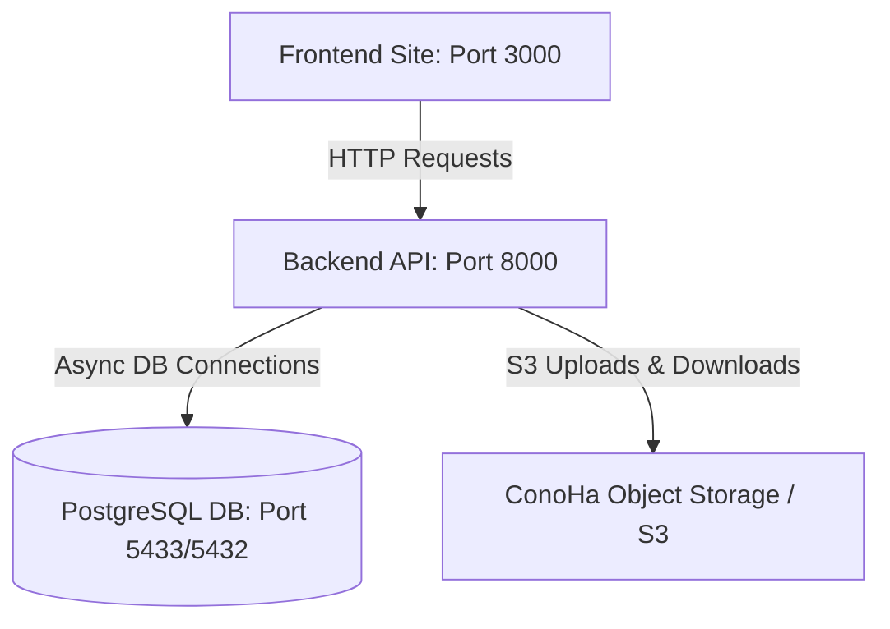

# Docker Build & Deployment Guide

This document describes how to build, run, and manage the **AI Ops Hub** platform using Docker and Docker Compose.

---

## 🏗️ Architecture Overview

The system consists of three main containerized components:

1. **Database (`ai_ops_hub_db`)**: A PostgreSQL 16 database running on port `5433` (externally) and `5432` (internally).
2. **Backend API (`ai_ops_hub_api`)**: A FastAPI Python service running on port `8000`. It utilizes S3/Object Storage for uploads and integrates with PostgreSQL.
3. **Frontend Website (`ai_ops_hub_site`)**: A Next.js (Node.js 18) application running on port `3000` with built-in multilingual (English & Japanese) support.



---

## 📋 Prerequisites

Before starting, ensure that you have installed:
- [Docker Engine](https://docs.docker.com/engine/install/) (v20.10 or later)
- [Docker Compose](https://docs.docker.com/compose/install/) (v2.0 or later)

---

## 🔌 Part 1: Backend API & Database Setup

### 1. Configure Environment Variables
Navigate to the `api/` directory and create the `.env` file from the example:
```bash
cd api
cp .env.example .env
```

Open `.env` and fill in your Object Storage / S3 configuration:
```env
# Database Credentials
POSTGRES_USER=postgres
POSTGRES_PASSWORD=postgres
POSTGRES_DB=ai_ops_hub

# S3 Object Storage Credentials (e.g. ConoHa)
AWS_ACCESS_KEY_ID=your_access_key
AWS_SECRET_ACCESS_KEY=your_secret_key
AWS_S3_ENDPOINT_URL=https://s3.c3j1.conoha.io
AWS_S3_BUCKET_NAME=ai-ops-hub-guides
AWS_S3_TENANT_ID=36fe601b5735409185cde2830978fb55
```

### 2. Build and Launch Backend Services
Start the database and FastAPI container services in detached mode:
```bash
docker compose up --build -d
```
This builds the backend image (using Astral `uv` for ultra-fast dependency caching) and sets up the database healthcheck dependencies.

### 3. Database Migration
Once the containers are running, execute database migrations to set up the schema:
```bash
docker compose exec api alembic upgrade head
```

---

## 🖥️ Part 2: Frontend Website Setup

### 1. Verify Configuration
The Next.js environment is configured via `site/docker-compose.yml`.
Ensure `NEXT_PUBLIC_API_URL` points to the running backend API service:
```yaml
environment:
  - NEXT_PUBLIC_API_URL=http://localhost:8000/v1
```

> [!NOTE]
> If deploying to a production server, change `localhost` to the public hostname or IP address of your API server.

### 2. Build and Launch Frontend
Navigate to the `site/` directory and build/start the Next.js production build container:
```bash
cd ../site
docker compose up --build -d
```
The Docker build runs in two stages:
1. **Builder Stage**: Installs development/production dependencies and builds Next.js assets (`.next`).
2. **Runner Stage**: Bundles the built outputs into a lightweight runner environment for optimal performance and size.

---

## 🛠️ Management & Monitoring Cheat Sheet

### 1. View Logs
To inspect real-time server output:
- **API and Database logs**:
  ```bash
  cd api
  docker compose logs -f
  ```
- **Website logs**:
  ```bash
  cd site
  docker compose logs -f
  ```

### 2. Status Check
Check container status, resource usage, and ports:
```bash
docker ps
```

### 3. Stop Services
To stop services without removing persistent database volume files:
```bash
docker compose down
```

To stop services and completely wipe database tables/volumes (Caution: Data loss!):
```bash
docker compose down -v
```

### 4. Interactive Shell
To launch a bash terminal inside the running backend container:
```bash
docker compose exec api bash
```
