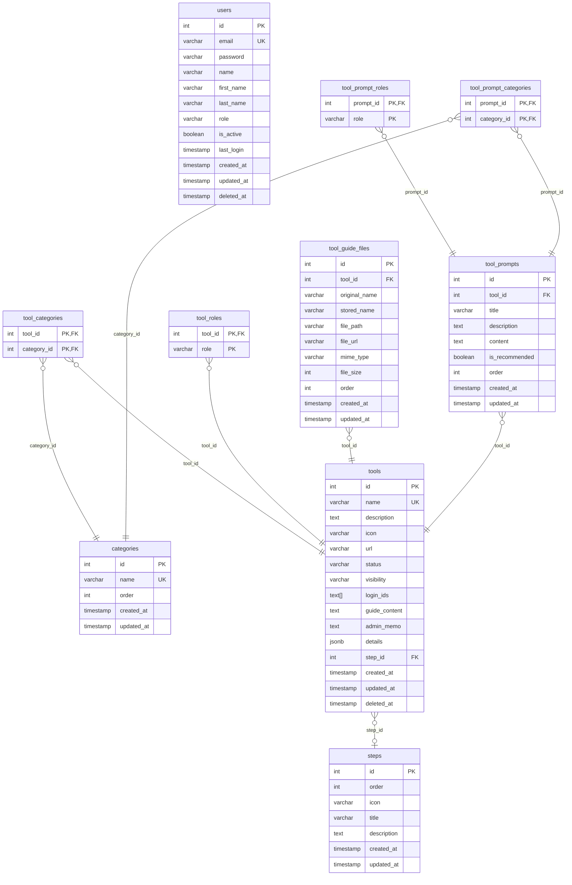

# AI Ops Hub — Database Design

Tài liệu này mô tả chi tiết thiết kế cấu trúc cơ sở dữ liệu (Database Schema) hệ thống **AI Ops Hub** sử dụng PostgreSQL, được chuẩn hóa và thiết kế đồng bộ với tài liệu [api.md](file:///Users/admin/Tqa/ai-ops-hub/docs/api.md) để hỗ trợ đầy đủ các tính năng của Frontend.

---

## 1. Sơ đồ thực thể liên kết (ERD)

---

## 2. Chi tiết các bảng dữ liệu

### 2.1 Bảng `users` (Quản lý người dùng)
Lưu trữ thông tin tài khoản, phân quyền và dữ liệu đăng nhập.

| Tên cột | Kiểu dữ liệu | Ràng buộc | Mô tả |
| :--- | :--- | :--- | :--- |
| `id` | `SERIAL` | `PRIMARY KEY` | Khóa chính tự tăng |
| `email` | `VARCHAR(255)` | `UNIQUE`, `NOT NULL` | Email định danh (dùng index) |
| `password` | `VARCHAR(255)` | `NOT NULL` | Mật khẩu đã băm (hash) |
| `name` | `VARCHAR(255)` | | Tên đầy đủ hiển thị |
| `first_name` | `VARCHAR(100)` | | Họ |
| `last_name` | `VARCHAR(100)` | | Tên |
| `role` | `VARCHAR(50)` | `DEFAULT 'sale'` | Quyền hạn: `sale`, `marketing`, `backoffice`, `accounting`, `admin` |
| `is_active` | `BOOLEAN` | `DEFAULT TRUE` | Trạng thái tài khoản |
| `last_login` | `TIMESTAMP` | | Thời điểm đăng nhập gần nhất |
| `created_at` | `TIMESTAMP` | `DEFAULT NOW()` | Thời điểm tạo bản ghi |
| `updated_at` | `TIMESTAMP` | `DEFAULT NOW()` | Thời điểm cập nhật gần nhất |
| `deleted_at` | `TIMESTAMP` | | Phục vụ cơ chế Soft Delete |

---

### 2.2 Bảng `steps` (Các bước Compliance Flow)
Các bước kiểm duyệt an toàn / tuân thủ quy trình.

| Tên cột | Kiểu dữ liệu | Ràng buộc | Mô tả |
| :--- | :--- | :--- | :--- |
| `id` | `SERIAL` | `PRIMARY KEY` | Khóa chính tự tăng |
| `order` | `INTEGER` | `NOT NULL` | Thứ tự sắp xếp các bước |
| `icon` | `VARCHAR(50)` | | Emoji hoặc ký tự đại diện cho bước |
| `title` | `VARCHAR(255)` | `NOT NULL` | Tiêu đề của bước |
| `description` | `TEXT` | | Mô tả hướng dẫn chi tiết |
| `created_at` | `TIMESTAMP` | `DEFAULT NOW()` | Thời điểm tạo bản ghi |
| `updated_at` | `TIMESTAMP` | `DEFAULT NOW()` | Thời điểm cập nhật gần nhất |

---

### 2.3 Bảng `categories` (Nhóm danh mục / Hubs)
Quản lý các nhóm Hub (Creative Hub, Data Hub, Compliance Hub).

| Tên cột | Kiểu dữ liệu | Ràng buộc | Mô tả |
| :--- | :--- | :--- | :--- |
| `id` | `SERIAL` | `PRIMARY KEY` | Khóa chính tự tăng |
| `name` | `VARCHAR(100)` | `UNIQUE`, `NOT NULL` | Tên danh mục (ví dụ: 'クリエイティブハブ') |
| `order` | `INTEGER` | `NOT NULL` | Thứ tự sắp xếp hiển thị |
| `created_at` | `TIMESTAMP` | `DEFAULT NOW()` | Thời điểm tạo bản ghi |
| `updated_at` | `TIMESTAMP` | `DEFAULT NOW()` | Thời điểm cập nhật gần nhất |

---

### 2.4 Bảng `tools` (Quản lý Công cụ AI)
Bảng chứa thông tin cốt lõi của các AI Tools.

| Tên cột | Kiểu dữ liệu | Ràng buộc | Mô tả |
| :--- | :--- | :--- | :--- |
| `id` | `SERIAL` | `PRIMARY KEY` | Khóa chính tự tăng |
| `name` | `VARCHAR(255)` | `UNIQUE`, `NOT NULL` | Tên công cụ (ví dụ: 'ChatGPT', có index) |
| `description` | `TEXT` | | Mô tả tóm tắt tính năng |
| `icon` | `VARCHAR(500)` | | Link URL icon / emoji |
| `url` | `VARCHAR(500)` | | Link URL của trang công cụ |
| `status` | `VARCHAR(50)` | `DEFAULT '公開中'` | Trạng thái hoạt động (ví dụ: '公開中') |
| `visibility` | `VARCHAR(10)` | `DEFAULT 'public'` | Phạm vi hiển thị: `public`, `draft` |
| `login_ids` | `TEXT[]` | `DEFAULT '{}'` | Danh sách tài khoản dùng chung |
| `guide_content` | `TEXT` | | Hướng dẫn sử dụng chi tiết (hỗ trợ Markdown) |
| `admin_memo` | `TEXT` | | Ghi chú nội bộ dành cho Admin |
| `details` | `JSONB` | | Chứa các thông tin cấu hình mở rộng (inputs, outputDescription) |
| `step_id` | `INTEGER` | `FOREIGN KEY` | Tham chiếu tới `steps.id` (`ON DELETE SET NULL`) |
| `created_at` | `TIMESTAMP` | `DEFAULT NOW()` | Thời điểm tạo bản ghi |
| `updated_at` | `TIMESTAMP` | `DEFAULT NOW()` | Thời điểm cập nhật gần nhất |
| `deleted_at` | `TIMESTAMP` | | Phục vụ cơ chế Soft Delete |

---

### 2.5 Bảng liên kết trung gian (Join Tables)

#### Bảng `tool_categories`
Liên kết nhiều-nhiều giữa Tools và Categories.
- `tool_id` (`INTEGER`, FK -> `tools.id`, `ON DELETE CASCADE`)
- `category_id` (`INTEGER`, FK -> `categories.id`, `ON DELETE CASCADE`)
- **Khóa chính**: `(tool_id, category_id)`

#### Bảng `tool_roles`
Cấu hình các vai trò (roles) được phép truy cập và sử dụng Tool.
- `tool_id` (`INTEGER`, FK -> `tools.id`, `ON DELETE CASCADE`)
- `role` (`VARCHAR(50)`, `NOT NULL`)
- **Khóa chính**: `(tool_id, role)`

---

### 2.6 Bảng `tool_guide_files` (Tài liệu đính kèm Tool)
Quản lý các tài liệu hướng dẫn hoặc tệp tin đính kèm bổ sung được tải lên thông qua Amazon S3.

| Tên cột | Kiểu dữ liệu | Ràng buộc | Mô tả |
| :--- | :--- | :--- | :--- |
| `id` | `SERIAL` | `PRIMARY KEY` | Khóa chính tự tăng |
| `tool_id` | `INTEGER` | `FOREIGN KEY` | Tham chiếu `tools.id` (`ON DELETE CASCADE`) |
| `original_name` | `VARCHAR(255)`| `NOT NULL` | Tên tệp gốc khi tải lên |
| `stored_name` | `VARCHAR(255)`| `NOT NULL` | Tên tệp lưu trữ ngẫu nhiên (UUID) |
| `file_path` | `VARCHAR(500)`| `NOT NULL` | Đường dẫn tệp trên S3 (S3 Key) |
| `file_url` | `VARCHAR(500)`| | Presigned URL hoặc Public URL của tệp |
| `mime_type` | `VARCHAR(100)`| | Định dạng tệp (ví dụ: 'application/pdf') |
| `file_size` | `INTEGER` | | Dung lượng tệp (bytes) |
| `order` | `INTEGER` | `DEFAULT 0` | Thứ tự hiển thị |
| `created_at` | `TIMESTAMP` | `DEFAULT NOW()` | Thời điểm tạo bản ghi |
| `updated_at` | `TIMESTAMP` | `DEFAULT NOW()` | Thời điểm cập nhật gần nhất |

---

### 2.7 Các bảng liên quan đến Prompt (Mẫu câu lệnh)

#### Bảng `tool_prompts`
Mẫu các câu lệnh gợi ý (prompt templates) đi kèm của từng Tool.
- `id` (`SERIAL`, PK)
- `tool_id` (`INTEGER`, FK -> `tools.id`, `ON DELETE CASCADE`)
- `title` (`VARCHAR(255)`, `NOT NULL`) - Tiêu đề prompt
- `description` (`TEXT`) - Mô tả prompt
- `content` (`TEXT`, `NOT NULL`) - Nội dung chi tiết của câu lệnh
- `is_recommended` (`BOOLEAN`, `DEFAULT FALSE`) - Đánh dấu prompt được khuyên dùng
- `order` (`INTEGER`, `DEFAULT 0`) - Thứ tự hiển thị
- `created_at`, `updated_at` (`TIMESTAMP`)

#### Bảng `tool_prompt_roles`
Các vai trò cụ thể được đề xuất sử dụng prompt này.
- `prompt_id` (`INTEGER`, FK -> `tool_prompts.id`, `ON DELETE CASCADE`)
- `role` (`VARCHAR(50)`)
- **Khóa chính**: `(prompt_id, role)`

#### Bảng `tool_prompt_categories`
Các danh mục/hub cụ thể được đề xuất sử dụng prompt này.
- `prompt_id` (`INTEGER`, FK -> `tool_prompts.id`, `ON DELETE CASCADE`)
- `category_id` (`INTEGER`, FK -> `categories.id`, `ON DELETE CASCADE`)
- **Khóa chính**: `(prompt_id, category_id)`
